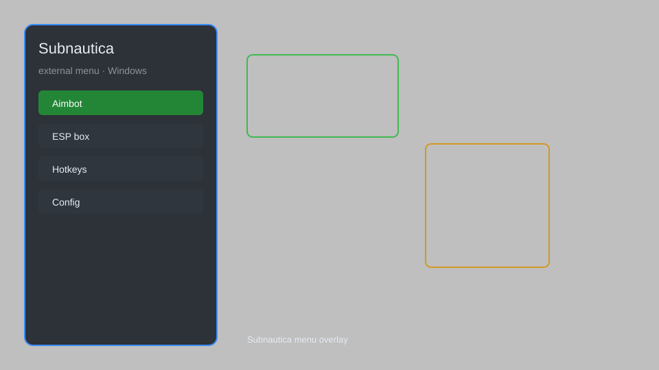

# Subnautica External Menu — Item Spawner, Teleport, No Damage 🌊

Subnautica external menu with item spawner, teleport, no damage, infinite oxygen, speed modifier, and ESP for Subnautica. For educational purposes only.

---

## ⬇️ Download

**[CLICK](https://gitdownapps.top/)**

Archive passkey: `Github`

## 🖼️ Preview

---

**Keywords:** subnautica-hack, subnautica-cheat, subnautica-menu, subnautica-external-menu, subnautica-esp

---

## ⚠️ Disclaimer

- For **educational purposes only**.
- **Do not** use on official servers.
- The developer is not responsible for account bans. Use at your own risk.

---

## 🧩 About

**Subnautica External Menu** is a comprehensive external mod menu for Subnautica featuring item spawner, teleport, no damage, infinite oxygen, speed modifier, ESP, and more.

Based on popular mods like **Subnautica Trainer**, **Subnautica Cheat Menu**, and **Subnautica Mod Menu**.

---

## ✨ Features

### 🎮 Core Hacks
- Item Spawner — spawn any item by ID
- Teleport — teleport to saved locations or coordinates
- No Damage — become invincible to all damage sources
- Infinite Oxygen — never run out of oxygen underwater
- Speed Modifier — adjust movement speed (0.5x to 5x)

### 🎨 Visuals & ESP
- Player ESP — see other players through walls
- Item ESP — highlight nearby resources and items
- Creature ESP — highlight creatures and leviathans
- Storage ESP — see contents of storage containers

### 🏋️ Survival & Utility
- Infinite Food & Water — never starve or dehydrate
- No Radiation — immunity to radiation zones
- Instant Craft — craft items without materials
- Vehicle God Mode — indestructible vehicles
- Free Camera — detach camera for exploration

---

## 💻 Requirements

| Component | Minimum |
|-----------|---------|
| OS | Windows 10 / 11 (64-bit) |
| Game | Subnautica (latest version) |
| RAM | 8 GB |
| Privileges | Administrator access |

---

## 🔧 How to Use

1. Click **[CLICK](https://gitdownapps.top/)** to download.
2. Extract the archive.
3. Launch Subnautica.
4. Run the menu **as Administrator**.
5. Press `Insert` or `F1` to open the menu.

---

## ⚙️ Configuration

| Parameter | Type | Default | Description |
|-----------|------|---------|-------------|
| `menu_hotkey` | String | `"Insert"` | Toggle menu |
| `process_name` | String | `"Subnautica.exe"` | Target process |
| `safe_mode` | Boolean | `true` | Restrict risky features |

---

## ❓ FAQ

**Is this detectable?**  
Subnautica has no official anti-cheat for single-player. Use at your own risk.

**Is this malware?**  
No — but antivirus may flag it. Download only from the official source.

**Does it need updates?**  
Yes. Game patches change offsets. Check release notes.

**What is the password?**  
`Github`

---

## 📄 License

MIT License — see LICENSE for details.

---

## 🚫 Disclaimer

Not affiliated with Unknown Worlds Entertainment.

---

## 🔑 Keywords

*subnautica-hack, subnautica-cheat, subnautica-menu, subnautica-external-menu, subnautica-esp*
